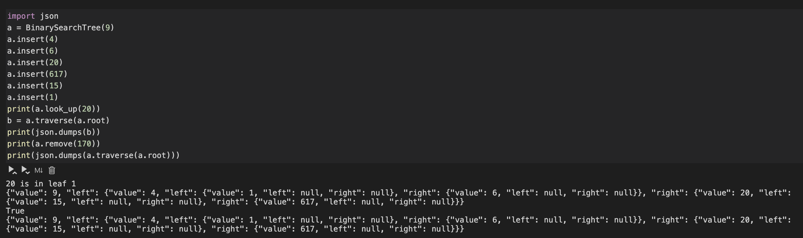
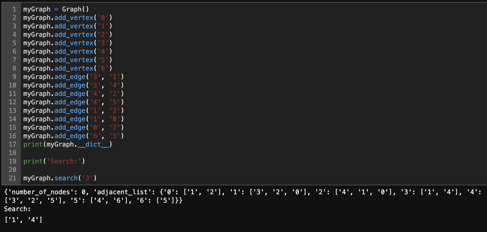

# Binary-Search-Tree
Implementation of Binary Search Tree Data Structure on Python.

The Binary Tree class has functionality of adding element to Tree Data Structure, Look Up a value and Remove a value.

Graphs class can add vertex, add edges for undirected graph ahd perform a search function.

## Trees Demo

## Graphs Demo

